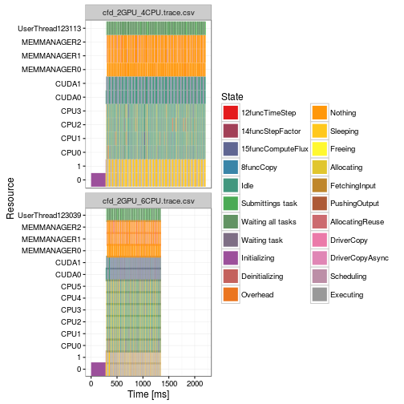
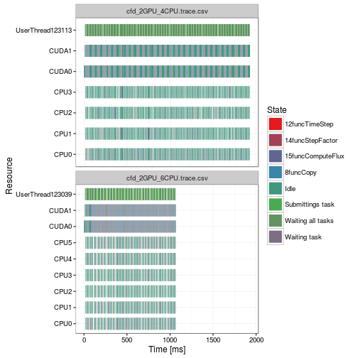
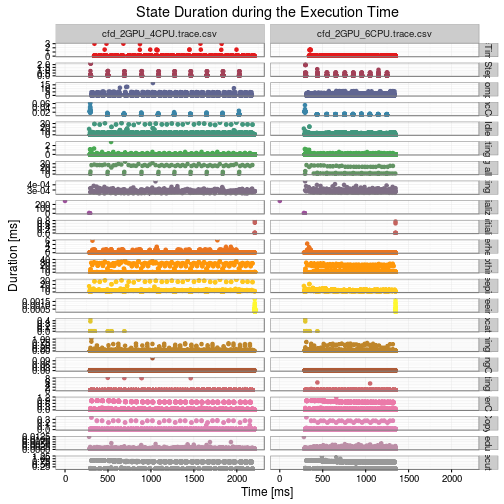
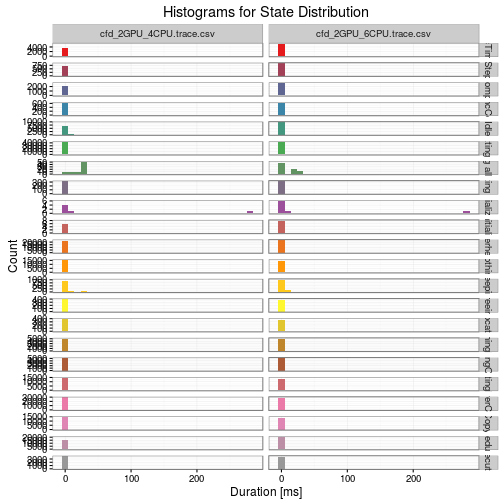
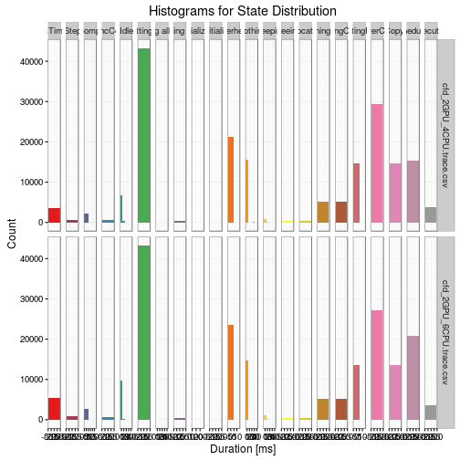

<div id="table-of-contents">
<h2>Table of Contents</h2>
<div id="text-table-of-contents">
<ul>
<li><a href="#sec-1">1. Introduction</a>
<ul>
<li>
<ul>
<li><a href="#sec-1-0-1">1.0.1. How to compile</a></li>
<li><a href="#sec-1-0-2">1.0.2. Software dependencies</a></li>
</ul>
</li>
</ul>
</li>
<li><a href="#sec-2">2. Gantt Charts of the whole Trace</a></li>
<li><a href="#sec-3">3. Table Summary</a></li>
<li><a href="#sec-4">4. State Duration during the Execution Time</a></li>
<li><a href="#sec-5">5. Distribution Histograms</a></li>
</ul>
</div>
</div>


# Introduction

This document presents a basic analysis of multiple StarPU
traces. First, paje *traces* will be transferred into *.csv* files and
then we analyze them with **R**. This summary is a first step that
should help researchers verify their hypothesis or find problematic
areas that require more exhaustive investigation.

Be cautious, as the following results are only a brief analysis of
the traces and many important phenomena could still be hidden. Also,
be very careful when comparing different states or traces. Even
though some large discrepancies can be irrelevant, in other cases
even the smallest differences can be essential in understanding what
exactly happened during the StarPU execution.

### How to compile

    ./starpu_summary.sh example.native.trace example.simgrid.trace

### Software dependencies

In order to run this analysis you need to have R installed:

    sudo apt-get install r-base 

Easiest way to transform *paje* traces generated by StarPU to *.csv* is to use *pjdump* program (<https://github.com/schnorr/pajeng>), so we encourage users to install it.

When R is installed, one will need to start R (e.g., from terminal) and install *knitr* package:

    R> install.packages("knitr")

Additional R packages used in this analysis (*ggplot2, plyr, data.table, RColorBrewer*) will be installed automatically when the document is compiled for the first time. If there is any trouble, install them by hand directly from R (the same way as *knitr*)

# Gantt Charts of the whole Trace

First, we show a simple gantt chart of every trace. X-axis is a
simple timeline of the execution, *Resources* on y-axis correspond
to different CPUs/GPUs that were used and finally different colors
represent different *States* of the application.

This kind of figures can often point to the idle time or
synchronization problems. Small disadvantage is that in most cases
there are too many states, thus it is impossible to display them all
on a single plot without aggregation. Therefore for any strange
behavior at a certain part of the trace, we strongly suggest to zoom
on the interval it occurred.



Second, we will concentrate only on computation kernel states, to
get rid of visualization artifacts that can be introduced by other
(sometimes irrelevant) states. Normally, this plot should not be too
different from the previous one.



# Table Summary

Here we present how much time application spent in each state
(OverallDuration), how many times it was in that state (Count),
mean and median values of duration (Mean and Median), and finally
what is a standard deviation (StandDev).

General information provided by this table can sometimes give an
idea to application experts which parts of code are not working as
desired. Be aware that this kind of tables hide many important
things, such as outliers, multiple modes, etc.


```
##                Value                  Origin OverallDuration Count         Mean     Median     StandDev
## 1     12funcTimeStep cfd_2GPU_4CPU.trace.csv      199.265091  3492 5.706331e-02  0.0719770 1.535485e-01
## 2     12funcTimeStep cfd_2GPU_6CPU.trace.csv      210.070472  5430 3.868701e-02  0.0135675 6.845390e-02
## 3   14funcStepFactor cfd_2GPU_4CPU.trace.csv       92.839086   733 1.266563e-01  0.0985880 1.955739e-01
## 4   14funcStepFactor cfd_2GPU_6CPU.trace.csv       97.448445   895 1.088809e-01  0.0971580 1.639992e-01
## 5  15funcComputeFlux cfd_2GPU_4CPU.trace.csv     1923.166741  2280 8.434942e-01  0.7132890 1.077231e+00
## 6  15funcComputeFlux cfd_2GPU_6CPU.trace.csv     1926.360353  2820 6.831065e-01  0.7057270 8.253441e-01
## 7          8funcCopy cfd_2GPU_4CPU.trace.csv        7.359195   640 1.149874e-02  0.0099285 5.660587e-03
## 8          8funcCopy cfd_2GPU_6CPU.trace.csv        6.698601   640 1.046656e-02  0.0093115 4.448930e-03
## 9               Idle cfd_2GPU_4CPU.trace.csv     7983.086401  7151 1.116359e+00  0.1075620 3.005072e+00
## 10              Idle cfd_2GPU_6CPU.trace.csv     4312.852794  9793 4.404016e-01  0.0655380 1.153103e+00
## 11  Submittings task cfd_2GPU_4CPU.trace.csv      113.237081 43290 2.615779e-03  0.0007440 2.141378e-02
## 12  Submittings task cfd_2GPU_6CPU.trace.csv      106.689524 43290 2.464530e-03  0.0007590 1.548719e-02
## 13 Waiting all tasks cfd_2GPU_4CPU.trace.csv     1614.992105    80 2.018740e+01 23.9171300 1.024171e+01
## 14 Waiting all tasks cfd_2GPU_6CPU.trace.csv      788.718229    80 9.858978e+00  3.0702265 1.028762e+01
## 15      Waiting task cfd_2GPU_4CPU.trace.csv        0.090874   320 2.839813e-04  0.0002800 2.890639e-05
## 16      Waiting task cfd_2GPU_6CPU.trace.csv        0.092658   320 2.895562e-04  0.0002840 2.962826e-05
## 17      Initializing cfd_2GPU_4CPU.trace.csv      290.009928     6 4.833499e+01  0.0133000 1.137971e+02
## 18      Initializing cfd_2GPU_6CPU.trace.csv      290.534521     8 3.631682e+01  0.0128615 9.882864e+01
## 19    Deinitializing cfd_2GPU_4CPU.trace.csv        1.503309     6 2.505515e-01  0.0173175 3.736274e-01
## 20    Deinitializing cfd_2GPU_6CPU.trace.csv        1.374437     8 1.718046e-01  0.0035760 3.135734e-01
## 21          Overhead cfd_2GPU_4CPU.trace.csv      338.185601 21196 1.595516e-02  0.0021460 1.196479e-01
## 22          Overhead cfd_2GPU_6CPU.trace.csv      205.550053 23575 8.718984e-03  0.0025600 5.017731e-02
## 23           Nothing cfd_2GPU_4CPU.trace.csv     5025.708056 15859 3.168994e-01  0.0010010 2.848438e+00
## 24           Nothing cfd_2GPU_6CPU.trace.csv     2513.254047 14743 1.704710e-01  0.0009930 1.716321e+00
## 25          Sleeping cfd_2GPU_4CPU.trace.csv     3302.508235  1029 3.209435e+00  0.0622160 6.698849e+00
## 26          Sleeping cfd_2GPU_6CPU.trace.csv     2354.241428  1201 1.960234e+00  0.0449560 2.445615e+00
## 27           Freeing cfd_2GPU_4CPU.trace.csv        0.144638   396 3.652475e-04  0.0003450 1.429988e-04
## 28           Freeing cfd_2GPU_6CPU.trace.csv        0.143935   368 3.911277e-04  0.0003935 1.408832e-04
## 29        Allocating cfd_2GPU_4CPU.trace.csv        1.020934   396 2.578116e-03  0.0003810 3.018082e-02
## 30        Allocating cfd_2GPU_6CPU.trace.csv        1.004497   368 2.729611e-03  0.0004075 3.073964e-02
## 31     FetchingInput cfd_2GPU_4CPU.trace.csv       40.826403  5120 7.973907e-03  0.0015265 5.071038e-02
## 32     FetchingInput cfd_2GPU_6CPU.trace.csv       40.021508  5120 7.816701e-03  0.0015690 4.874165e-02
## 33     PushingOutput cfd_2GPU_4CPU.trace.csv        3.421156  5120 6.681945e-04  0.0006430 1.590273e-03
## 34     PushingOutput cfd_2GPU_6CPU.trace.csv        3.465778  5120 6.769098e-04  0.0006240 2.927144e-04
## 35   AllocatingReuse cfd_2GPU_4CPU.trace.csv       63.402384 14671 4.321613e-03  0.0008810 1.492889e-01
## 36   AllocatingReuse cfd_2GPU_6CPU.trace.csv       29.252969 13639 2.144803e-03  0.0007870 5.903666e-02
## 37        DriverCopy cfd_2GPU_4CPU.trace.csv      506.929342 29342 1.727658e-02  0.0010585 1.026193e-01
## 38        DriverCopy cfd_2GPU_6CPU.trace.csv      473.062382 27278 1.734227e-02  0.0009490 1.044398e-01
## 39   DriverCopyAsync cfd_2GPU_4CPU.trace.csv      138.561937 14671 9.444614e-03  0.0073590 1.615954e-02
## 40   DriverCopyAsync cfd_2GPU_6CPU.trace.csv      129.686343 13639 9.508494e-03  0.0072530 1.655817e-02
## 41        Scheduling cfd_2GPU_4CPU.trace.csv       10.574039 15319 6.902565e-04  0.0005980 3.191176e-04
## 42        Scheduling cfd_2GPU_6CPU.trace.csv       16.451932 20771 7.920626e-04  0.0006520 4.070240e-04
## 43         Executing cfd_2GPU_4CPU.trace.csv     1476.773513  3805 3.881139e-01  0.1058530 3.272408e-01
## 44         Executing cfd_2GPU_6CPU.trace.csv     1426.649735  3542 4.027808e-01  0.1134845 3.304169e-01
```

# State Duration during the Execution Time

Now, we show how duration of each state was changing during the
execution. This can display a general behavior of a state; show if
there are outliers or multiple modes; are some events occurring in
groups, etc. . It can also suggest a strange behavior of a state
during a certain time interval, which should be later investigated
more carefully.

  However, since each event is represented by a single point (and
there is no "alpha" factor), those events that happen almost
simultaneously are overplotted. Therefore density of events along
execution time may not be easy to read.



# Distribution Histograms

Finally, we show a distribution of *Duration* for each state in form
of histograms. X-axis is partitioned into bins with equidistant time
intervals in milliseconds, while y-axis represents the number of
occurrences inside such intervals for a certain state. Note that for
the first plot y-axis is not fixed, meaning that the scale changes
from one row to another. This plot allows to not only to see what
was the most frequent duration of a state, but also to compare
duration between different states.



Similar to the previous figure, only now traces are showed vertically
instead of horizontally. Note that for this plot x-axis is not fixed,
meaning that the scale changes from one column to another. This plot
allows to compare frequency of different states and in case of
multiple traces to easily compare duration distribution for each
state.


