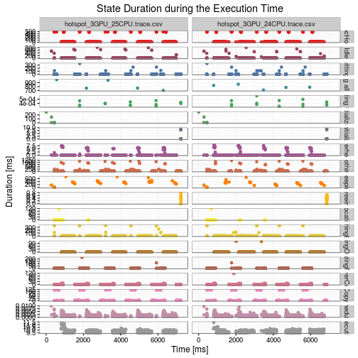

<div id="table-of-contents">
<h2>Table of Contents</h2>
<div id="text-table-of-contents">
<ul>
<li><a href="#sec-1">1. Introduction</a>
<ul>
<li>
<ul>
<li><a href="#sec-1-0-1">1.0.1. How to compile</a></li>
<li><a href="#sec-1-0-2">1.0.2. Software dependencies</a></li>
</ul>
</li>
</ul>
</li>
<li><a href="#sec-2">2. Gantt Charts of the whole Trace</a></li>
<li><a href="#sec-3">3. Table Summary</a></li>
<li><a href="#sec-4">4. State Duration during the Execution Time</a></li>
<li><a href="#sec-5">5. Distribution Histograms</a></li>
</ul>
</div>
</div>


# Introduction

This document presents a basic analysis of multiple StarPU
traces. First, paje *traces* will be transferred into *.csv* files and
then we analyze them with **R**. This summary is a first step that
should help researchers verify their hypothesis or find problematic
areas that require more exhaustive investigation.

Be cautious, as the following results are only a brief analysis of
the traces and many important phenomena could still be hidden. Also,
be very careful when comparing different states or traces. Even
though some large discrepancies can be irrelevant, in other cases
even the smallest differences can be essential in understanding what
exactly happened during the StarPU execution.

### How to compile

    ./starpu_summary.sh example.native.trace example.simgrid.trace

### Software dependencies

In order to run this analysis you need to have R installed:

    sudo apt-get install r-base 

Easiest way to transform *paje* traces generated by StarPU to *.csv* is to use *pjdump* program (<https://github.com/schnorr/pajeng>), so we encourage users to install it.

When R is installed, one will need to start R (e.g., from terminal) and install *knitr* package:

    R> install.packages("knitr")

Additional R packages used in this analysis (*ggplot2, plyr, data.table, RColorBrewer*) will be installed automatically when the document is compiled for the first time. If there is any trouble, install them by hand directly from R (the same way as *knitr*)

# Gantt Charts of the whole Trace

First, we show a simple gantt chart of every trace. X-axis is a
simple timeline of the execution, *Resources* on y-axis correspond
to different CPUs/GPUs that were used and finally different colors
represent different *States* of the application.

This kind of figures can often point to the idle time or
synchronization problems. Small disadvantage is that in most cases
there are too many states, thus it is impossible to display them all
on a single plot without aggregation. Therefore for any strange
behavior at a certain part of the trace, we strongly suggest to zoom
on the interval it occurred.


Second, we will concentrate only on computation kernel states, to
get rid of visualization artifacts that can be introduced by other
(sometimes irrelevant) states. Normally, this plot should not be too
different from the previous one.


# Table Summary

Here we present how much time application spent in each state
(OverallDuration), how many times it was in that state (Count),
mean and median values of duration (Mean and Median), and finally
what is a standard deviation (StandDev).

General information provided by this table can sometimes give an
idea to application experts which parts of code are not working as
desired. Be aware that this kind of tables hide many important
things, such as outliers, multiple modes, etc.


```
##                Value                       Origin OverallDuration Count         Mean      Median     StandDev
## 1      11funcHotspot hotspot_3GPU_25CPU.trace.csv    1.334674e+05  1280 1.042714e+02   9.8618480 1.933143e+02
## 2      11funcHotspot hotspot_3GPU_24CPU.trace.csv    1.301370e+05  1280 1.016695e+02   9.8971790 1.913522e+02
## 3               Idle hotspot_3GPU_25CPU.trace.csv    1.059931e+04  1308 8.103449e+00   0.0152025 6.890130e+01
## 4               Idle hotspot_3GPU_24CPU.trace.csv    9.461111e+03  1307 7.238800e+00   0.0151630 5.899887e+01
## 5    Submitting task hotspot_3GPU_25CPU.trace.csv    1.410190e+03  7120 1.980604e-01   0.0016250 6.436932e+00
## 6    Submitting task hotspot_3GPU_24CPU.trace.csv    1.807343e+03  7120 2.538403e-01   0.0016480 7.259889e+00
## 7  Waiting all tasks hotspot_3GPU_25CPU.trace.csv    4.164761e+03     5 8.329523e+02 761.9460840 1.282296e+02
## 8  Waiting all tasks hotspot_3GPU_24CPU.trace.csv    3.967964e+03     5 7.935927e+02 784.8334540 5.626077e+01
## 9       Waiting task hotspot_3GPU_25CPU.trace.csv    5.886000e-03    15 3.924000e-04   0.0003950 4.343106e-05
## 10      Waiting task hotspot_3GPU_24CPU.trace.csv    6.011000e-03    15 4.007333e-04   0.0003750 7.631557e-05
## 11      Initializing hotspot_3GPU_25CPU.trace.csv    4.300275e+02    28 1.535813e+01   0.0130500 5.819303e+01
## 12      Initializing hotspot_3GPU_24CPU.trace.csv    4.299486e+02    27 1.592402e+01   0.0132300 5.916842e+01
## 13    Deinitializing hotspot_3GPU_25CPU.trace.csv    2.573204e+01    28 9.190013e-01   0.0381700 2.605135e+00
## 14    Deinitializing hotspot_3GPU_24CPU.trace.csv    2.810641e+01    27 1.040978e+00   0.0303420 2.930787e+00
## 15          Overhead hotspot_3GPU_25CPU.trace.csv    4.038595e+02  4901 8.240348e-02   0.0036920 6.586921e-01
## 16          Overhead hotspot_3GPU_24CPU.trace.csv    5.111665e+02  4907 1.041709e-01   0.0036180 7.626837e-01
## 17           Nothing hotspot_3GPU_25CPU.trace.csv    2.185884e+04  3398 6.432855e+00   0.0020005 7.377330e+01
## 18           Nothing hotspot_3GPU_24CPU.trace.csv    2.023695e+04  3526 5.739351e+00   0.0020135 6.829886e+01
## 19          Sleeping hotspot_3GPU_25CPU.trace.csv    5.124861e+04   168 3.050512e+02 359.5246365 1.434572e+02
## 20          Sleeping hotspot_3GPU_24CPU.trace.csv    3.886991e+04   162 2.399377e+02 274.0657195 1.234337e+02
## 21           Freeing hotspot_3GPU_25CPU.trace.csv    2.300163e+01   439 5.239551e-02   0.0006970 1.411097e-01
## 22           Freeing hotspot_3GPU_24CPU.trace.csv    2.589568e+01   477 5.428863e-02   0.0007150 1.427263e-01
## 23        Allocating hotspot_3GPU_25CPU.trace.csv    1.423211e+02   439 3.241937e-01   0.0017080 5.505581e+00
## 24        Allocating hotspot_3GPU_24CPU.trace.csv    1.444688e+02   477 3.028696e-01   0.0017270 5.306397e+00
## 25     FetchingInput hotspot_3GPU_25CPU.trace.csv    5.457828e+03  1280 4.263928e+00   0.0031325 3.764091e+01
## 26     FetchingInput hotspot_3GPU_24CPU.trace.csv    4.342059e+03  1280 3.392234e+00   0.0030885 3.359769e+01
## 27     PushingOutput hotspot_3GPU_25CPU.trace.csv    1.882246e+00  1280 1.470505e-03   0.0013295 4.228133e-04
## 28     PushingOutput hotspot_3GPU_24CPU.trace.csv    3.290577e+02  1280 2.570763e-01   0.0012735 5.277466e+00
## 29   AllocatingReuse hotspot_3GPU_25CPU.trace.csv    3.539174e+02  2081 1.700708e-01   0.0014850 5.692442e+00
## 30   AllocatingReuse hotspot_3GPU_24CPU.trace.csv    1.216528e+02  2095 5.806815e-02   0.0015180 2.548035e+00
## 31        DriverCopy hotspot_3GPU_25CPU.trace.csv    7.703987e+02  4162 1.851030e-01   0.0025070 1.337336e+00
## 32        DriverCopy hotspot_3GPU_24CPU.trace.csv    1.070453e+03  4190 2.554780e-01   0.0026730 2.335954e+00
## 33   DriverCopyAsync hotspot_3GPU_25CPU.trace.csv    2.938392e+03  2081 1.412010e+00   0.5407850 9.982089e+00
## 34   DriverCopyAsync hotspot_3GPU_24CPU.trace.csv    2.982665e+03  2095 1.423707e+00   0.5671160 9.879423e+00
## 35        Scheduling hotspot_3GPU_25CPU.trace.csv    3.774703e+00  3868 9.758798e-04   0.0006240 7.311915e-04
## 36        Scheduling hotspot_3GPU_24CPU.trace.csv    3.755639e+00  3867 9.712022e-04   0.0006450 7.691083e-04
## 37         Executing hotspot_3GPU_25CPU.trace.csv    1.011560e+04  1033 9.792447e+00   9.8123000 2.606950e-01
## 38         Executing hotspot_3GPU_24CPU.trace.csv    1.018716e+04  1040 9.795343e+00   9.8189030 2.255394e-01
```

# State Duration during the Execution Time

Now, we show how duration of each state was changing during the
execution. This can display a general behavior of a state; show if
there are outliers or multiple modes; are some events occurring in
groups, etc. . It can also suggest a strange behavior of a state
during a certain time interval, which should be later investigated
more carefully.

  However, since each event is represented by a single point (and
there is no "alpha" factor), those events that happen almost
simultaneously are overplotted. Therefore density of events along
execution time may not be easy to read.



# Distribution Histograms

Finally, we show a distribution of *Duration* for each state in form
of histograms. X-axis is partitioned into bins with equidistant time
intervals in milliseconds, while y-axis represents the number of
occurrences inside such intervals for a certain state. Note that for
the first plot y-axis is not fixed, meaning that the scale changes
from one row to another. This plot allows to not only to see what
was the most frequent duration of a state, but also to compare
duration between different states.


Similar to the previous figure, only now traces are showed vertically
instead of horizontally. Note that for this plot x-axis is not fixed,
meaning that the scale changes from one column to another. This plot
allows to compare frequency of different states and in case of
multiple traces to easily compare duration distribution for each
state.


